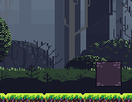
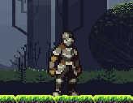
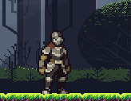
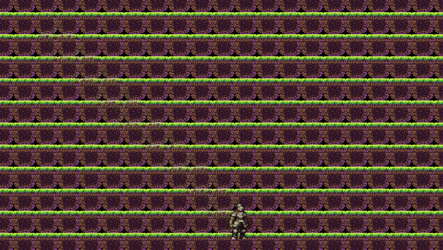
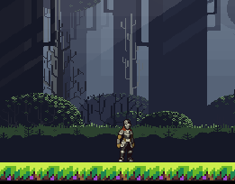
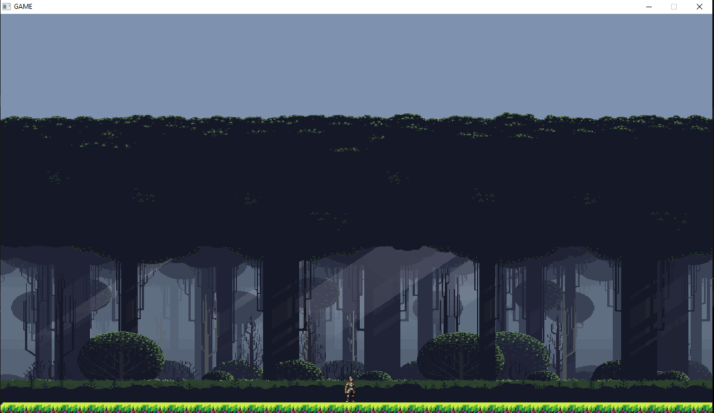

# Slatformer
A 2D CozyGame in C++ and SDL2

This is a simple cozy game using free assets and C++
I want to understand how to make a native product to inform more complex projects

Currently you are a knight

## Latest Build

### V 0.3
- Animations and Keyboard Movement
- ECS and component system 
- AABBPlayer Collision
- 

|                                                                          Animations                                                                           |                     Media                      |
|:-------------------------------------------------------------------------------------------------------------------------------------------------------------:|:----------------------------------------------:|
|                                                                             Walk                                                                              |     |
|                                                                             Idle                                                                              |    |
|                                                                         Basic Attack                                                                          |  |
-----------

### V 0.2
- V 0.2
- Map and tilemap implemented
- GameObjects BABYY
- 

-----------
- V 0.1
-  
-  
- Cannot download yet
- Character movable
- No physics Engine yet