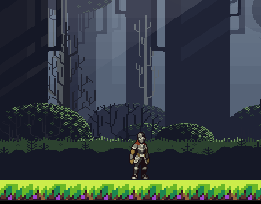
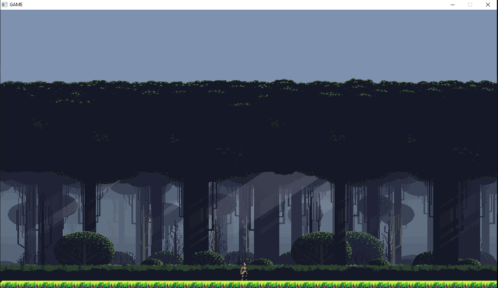

# Slatformer
A 2D CozyGame in C++ and SDL2

This is a simple cozy game using free assets and C++
I want to understand how to make a native product to inform more complex projects

Currently you are a knight

## Latest Build

### V 0.1
- V 1.0
-  
-  
- Cannot download yet
- Character movable
- No physics Engine yet